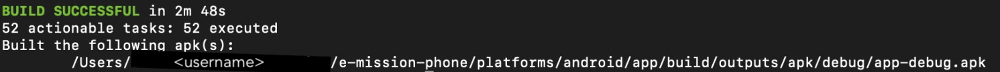

# [e-mission phone app](https://github.com/e-mission/e-mission-phone/tree/master)

<u>__This is the phone component of the e-mission system.__</u>

:sparkles: This has now been upgraded to cordova android@12.0.0 and iOS@6.2.0. It has also been upgraded to [android API 33 and the latest iOS versions](https://github.com/e-mission/e-mission-docs/issues/934), [cordova-lib@10.0.0 and the most recent node and npm versions](<insert link>). It also now supports CI, so we should not have any build issues in the future. __This should be ready to build out of the box.__

## Additional Documentation
Additional documentation has been moved to its own repository [e-mission-docs](https://github.com/e-mission/e-mission-docs). Specific e-mission-phone wikis can be found here:
https://github.com/e-mission/e-mission-docs/tree/master/docs/e-mission-phone

**Issues:** Since this repository is part of a larger project, all issues are tracked [in the central docs repository](https://github.com/e-mission/e-mission-docs/issues). If you have a question, [as suggested by the open source guide](https://opensource.guide/how-to-contribute/#communicating-effectively), please file an issue instead of sending an email. Since issues are public, other contributors can try to answer the question and benefit from the answer.

:sparkles: Check 6. [Contributing](#6-contributing) if you're interested in contributing for this project :sparkles:

## Contents
#### 1. [Creating logos](#1-creating-logos) -> Information regarding app Logo
#### 2. [Updating the UI only](#2-updating-the-ui-only) -> For UI changes ONLY
#### 3. [Updating the e-mission-* plugins or adding new plugins](#3-updating-the-e-mission--plugins-or-adding-new-plugins) -> Work with native code
#### 4. [End to End Testing](#4-end-to-end-testing)
#### 5. [Beta-testing debugging](#5-beta-testing-debugging) 
#### 6. [Contributing](#6-contributing)

---

## 1. Creating logos

If you are building your own version of the app, you must have your own logo to
avoid app store conficts. Updating the logo is very simple using the [`ionic
cordova resources`](https://ionicframework.com/docs/v3/cli/cordova/resources/)
command.

**Note**: You may have to install the [`cordova-res` package](https://github.com/ionic-team/cordova-res) for the command to work

## 2. Updating the UI only
[](https://github.com/e-mission/e-mission-phone/actions?query=workflow%3Aosx-serve-install)

If you want to make only UI changes, (as opposed to modifying the existing plugins, adding new plugins, etc), you can use the **new and improved** (as of June 2018) [e-mission dev app](https://github.com/e-mission/e-mission-devapp/) and install the most recent version from [releases](https://github.com/e-mission/e-mission-devapp/releases). 

### Installing (one-time)

1. Run the setup script

```
bash setup/setup_serve.sh
```
**(optional)** Configure by changing the files in `www/json`.
Defaults are in `www/json/*.sample`

```
ls www/json/*.sample
cp www/json/startupConfig.json.sample www/json/startupConfig.json
cp ..... www/json/connectionConfig.json
```

### Activation (after install, and in every new shell)
2. Run this to activate 
```
source setup/activate_serve.sh
```
  
### Running

1. Start the phonegap deployment server and note the URL(s) that the server is listening to.

    ```
   npm run serve
    ....
    [phonegap] listening on 10.0.0.14:3000
    [phonegap] listening on 192.168.162.1:3000
    [phonegap]
    [phonegap] ctrl-c to stop the server
    [phonegap]
    ....
    ```
  
2. Change the devapp connection URL to one of these (e.g. 192.168.162.1:3000) and press "Connect"
3. The app will now display the version of e-mission app that is in your local directory
  4. The console logs will be displayed back in the server window (prefaced by `[console]`)
  5. Breakpoints can be added by connecting through the browser
    - Safari ([enable develop menu](https://support.apple.com/guide/safari/use-the-safari-develop-menu-sfri20948/mac)): Develop -> Simulator -> index.html
    - Chrome: chrome://inspect -> Remote target (emulator)
    
**Ta-da!** :gift: If you change any of the files in the `www` directory, the app will automatically be re-loaded without manually restarting either the server or the app :tada:

**Note1**: You may need to scroll up, past all the warnings about `Content Security Policy has been added` to find the port that the server is listening to.

## 3. Updating the e-mission-\* plugins or adding new plugins

[](https://github.com/e-mission/e-mission-phone/actions/workflows/ios-build.yml)
[](https://github.com/e-mission/e-mission-phone/actions/workflows/android-build.yml)

__Important__

Most of the recent issues encountered have been due to incompatible setup. We
have now:
- locked down the dependencies,
- created setup and teardown scripts to setup self-contained environments with
  those dependencies, and
- CI enabled to validate that they continue work.

If you have setup failures, please compare the configuration in the **passing CI
builds** with your configuration. That is almost certainly the source of the error.

### Tested on
__MacOS__
- Intel chip, MacOS Ventura 13.6
- Intel chip, MacOS Ventura 13.5.2
- Intel chip, MacOS Ventura 13.0
- Intel chip, MacOS Monterey 12.6.7

Pre-requisites
---
- The version of xcode used by the CI.
    - to install a particular version, use [xcode-select](https://www.unix.com/man-page/OSX/1/xcode-select/)
    - or this [supposedly easier to use repo](https://github.com/xcpretty/xcode-install)
    - **NOTE**: the basic xcode install on Catalina was messed up for me due to a prior installation of command line tools. [These workarounds helped](https://github.com/nodejs/node-gyp/blob/master/macOS_Catalina.md).
- git
- Java 17. Tested with [OpenJDK 17 (Temurin) using AdoptOpenJDK](https://adoptium.net). 
- if you are not on the most recent version of OSX: `homebrew`
    - this allows us to install the current version of cocoapods without
      running into ruby incompatibilities - e.g.
      https://github.com/CocoaPods/CocoaPods/issues/11763

__1. Export statements__
```
export ANDROID_SDK_ROOT="/Users/<user_name>/Library/Android/sdk"
```
```
export ANDROID_HOME="/Users/<user_name>/Library/Android/sdk"
```
aka the path where you want the SDK to be installed. 

To setup JAVA_HOME (after installing the latest JDK ), run this command:
```
/usr/libexec/java_home
```
Find the location of the Java installation (Default will look something like this:)
```
/Library/Java/JavaVirtualMachines/...
```
and then export the package as:
```
export JAVA_HOME="<path you derived from the above command>"
```

- android SDK; install manually or use setup script below (**recommended**). Note that you only need to run this once **per computer**.
    ```
    bash setup/prereq_android_sdk_install.sh
    ```

    <details><summary>Expected output</summary>

    ```
    Downloading the command line tools for mac
      % Total    % Received % Xferd  Average Speed   Time    Time     Time  Current
                                     Dload  Upload   Total   Spent    Left  Speed
    100  114M  100  114M    0     0  8092k      0  0:00:14  0:00:14 --:--:-- 8491k
    Found downloaded file at /tmp/commandlinetools-mac-8092744_latest.zip
    Installing the command line tools
    Archive:  /tmp/commandlinetools-mac-8092744_latest.zip
    ...
    Downloading the android SDK. This will take a LONG time and will require you to agree to lots of licenses.
    Do you wish to continue? (Y/N)Y
    ...
    Accept? (y/N): Y
    ...
    [======                                 ] 17% Downloading x86_64-23_r33.zip... s
    ```

    </details>


__2. Installing (one time only)__

- Run the setup script for the platform you want to build

```
bash setup/setup_android_native.sh
AND/OR
bash setup/setup_ios_native.sh
```

**(optional)** Configure by changing the files in `www/json`.
Defaults are in `www/json/*.sample`

```
ls www/json/*.sample
cp www/json/startupConfig.json.sample www/json/startupConfig.json
cp ..... www/json/connectionConfig.json
```

If connecting to a development server over http, make sure to turn on http support on android

```
    <edit-config file="app/src/main/AndroidManifest.xml" mode="merge" target="/manifest/application">
        <application android:usesCleartextTraffic="true"/>
    </edit-config>
```
__3. Run this in every new shell__ 

- __Activation__
```
source setup/activate_native.sh
```
<details><summary> Expected Output </summary>

``` 
Activating nvm
Using version 19.5.0
Now using node v19.5.0 (npm v9.3.1)
npm version = 9.3.1
Adding cocoapods to the path
Verifying /Users/<username>/Library/Android/sk or /Users/<username>/Library/Android/sdk is set
Activating sdkman, and by default, gradle
Ensuring that we use the most recent version of the command line tools
Configuring the repo for building native code
Copied config.cordovabuild.xml -> config.xml and package.cordovabuild.json -> package.json
```

</details>

- __Pick a type of build and execute the following:__

More "versions" are available in [`package.cordovabuild.json`](https://github.com/e-mission/e-mission-phone/blob/fce117ff859abd995613bd405dbc7d27c703b09b/package.cordovabuild.json)
```
npm run <type_of_build>
```

For instance: (build-dev-android)
```
npm run build-dev-android
```
Your output should look something like this:


## 4. End to End Testing

A lot of the visualizations that we display in the phone client come from the server. In order to do end to end testing, we need to run a local server and connect to it. Instructions for:

1. installing a local server,
2. running it, 
3. loading it with test data, and
4. running analysis on it

are available in the [e-mission-server README](https://github.com/e-mission/e-mission-server/blob/master/README.md).

In order to make end to end testing easy, if the local server is started on a HTTP (versus HTTPS port), it is in development mode.  By default, the phone app connects to the local server (localhost on iOS, [10.0.2.2 on android](https://stackoverflow.com/questions/5806220/how-to-connect-to-my-http-localhost-web-server-from-android-emulator-in-eclips)) with the `prompted-auth` authentication method. To connect to a different server, or to use a different authentication method, you need to create a `www/json/connectionConfig.json` file. More details on configuring authentication [can be found in the docs](https://github.com/e-mission/e-mission-docs/blob/master/docs/install/configuring_authentication.md).

One advantage of using `skip` authentication in development mode is that any user email can be entered without a password. Developers can use one of the emails that they loaded test data for in step (3) above. So if the test data loaded was with `-u shankari@eecs.berkeley.edu`, then the login email for the phone app would also be `shankari@eecs.berkeley.edu`.

## 5. Beta-testing debugging
If users run into problems, they have the ability to email logs to the
maintainer. These logs are in the form of an sqlite3 database, so they have to
be opened using `sqlite3`. Alternatively, you can export it to a csv with
dates using the `bin/csv_export_add_date.py` script.

```
<download the log file>
mv ~/Downloads/loggerDB /tmp/logger.<issue>
pwd
.../e-mission-phone
python bin/csv_export_add_date.py /tmp/loggerDB.<issue>
less /tmp/loggerDB.<issue>.withdate.log
```

## 6. Contributing


1. Add the main repo as upstream
```
2. git remote add upstream <link/SSH key...>
```
3. Create a new branch (IMPORTANT). Please do not submit pull requests from master
```
4. git checkout -b <branch>
```
5. Make changes to the branch and commit them
```
6. git commit
```
 7. Push the changes to your local fork
```
8. git push origin <branch>
```
9. Generate a pull request from the UI

__\*__Address my review comments__\*__

Once I merge the pull request, pull the changes to your fork and delete the branch
```
git checkout master
```
```
git pull upstream master
```
```
git push origin master
```
```
git branch -d <branch>
```

---
### Troubleshooting
1. Xcode command line tools
```
Warning: No developer tools installed.
You should install the Command Line Tools.
```
```
xcode-select --install
```

2. Creating Logos
- Make sure to use `npx ionic` and `npx cordova`. This is
  because the setup script installs all the modules locally in a self-contained
  environment using `npm install` and not `npm install -g`
- Check the CI to see whether there is a known issue
- Run the commands from the script one by one and see which fails
    - compare the failed command with the CI logs
- Another workaround is to delete the local environment and recreate it
    - javascript errors: `rm -rf node_modules && npm install`
    - native code compile errors: `rm -rf plugins && rm -rf platforms && npx cordova prepare`
